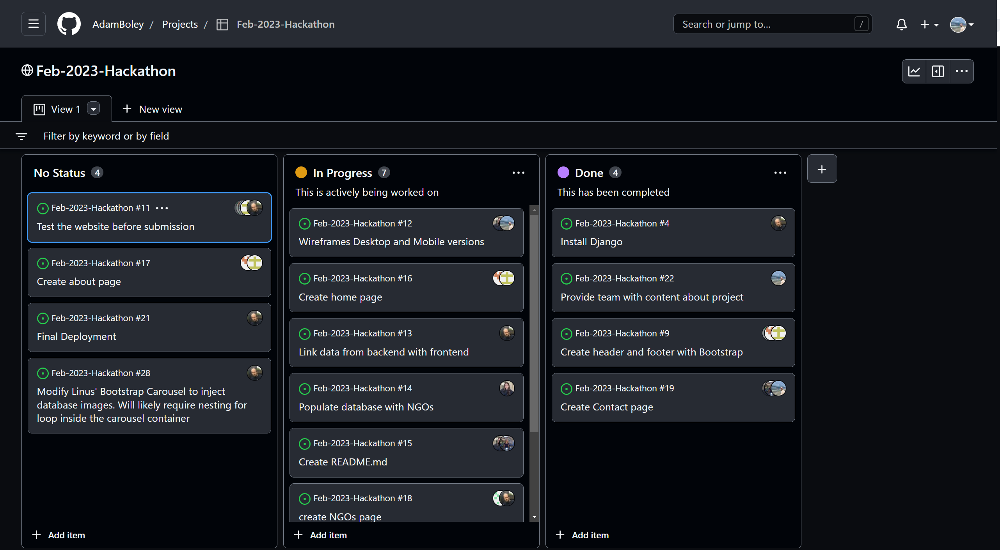
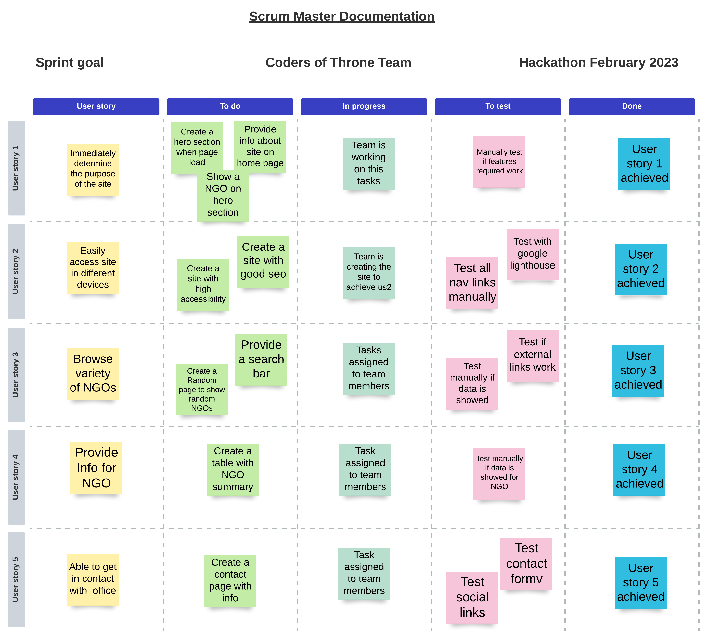
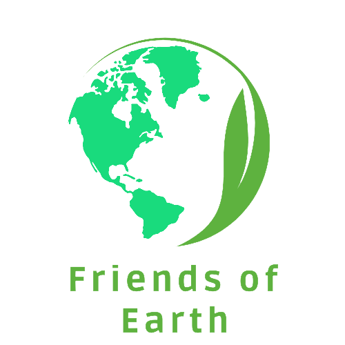

# Feb 2023 hackathon

Run Development server:
`python3 manage.py runserver`

# Friends of Earth

## The mission of our website is to act as an NGO directory, where users can find information about many different NGOs worldwide, and be directed to more information about each one if they choose.

# Table of Contents

- [Scope](#scope)
- [Background](#background)
- [Audience](#audience)
    - [User goals](#user-goals)
    - [Scrum Master](#scrum-master)
- [Wireframes](#wireframes)
- [Features](#features)
- [Development choices](#development-choices)
- [Design choices](#design-choices)
    - [Colour palette](#colour-palette)
    - [Font](#font)
    - [Images](#images)
- [Deployment](#deployment)
    - [Project set-up](#project-set-up)
    - [Development process](#development-process)
- [Bugs](#bugs)
- [Testing](#testing)
- [Credits](#credits)

# Scope

# Background

This project is part of the Code Institute February 2023 Hackathon. We researched World NGO Day and found that it aims to appreciate different NGOs across the world, and so decided that having a directory where users can browse different NGOs, perhaps filtering by region or type, would help users to find more specific information or bring awareness to different NGOs. It can also help users to find NGOs which they would like to be a part of or contribute towards.

**Repository:** [https://github.com/AdamBoley/Feb-2023-Hackathon](https://github.com/AdamBoley/Feb-2023-Hackathon)

**Final website:** [https://feb-2023-hackathon.herokuapp.com/](https://feb-2023-hackathon.herokuapp.com/)

# Audience

This project is aimed at anyone who wants to know more about NGOs worldwide. If the user wants to find out more or contribute directly to a specific NGO, they can find the link to take them directly to the NGO website itself.

## User goals

- To immediately determine the purpose of the site, so they can quickly decide whether or not to stay.
- To be able to easily access the site on a variety of devices - desktop, tablet, mobile.
- To be able to browse a variety of different NGOs in one place.
- To be able to filter NGOs by region.
- To be able to filter NGOs by type.
- To be able to read an overview of each NGO, e.g., purpose, founder and date it was founded, current director, location, etc.
- To be able to visit each NGO's website directly (opens in new tab).
- To find out information about World NGO day and when it is.

## Scrum Master

As a Scrum Master our team had [Edmir Demaj](https://www.linkedin.com/in/edmir-demaj-42a501196/).  As a Scrum Master my duties are:
- Work on Project idea together with team.
- Plan how team members will work on this project.
- Keep notes for any suggestions, ideas, changes on the project. 
- Find out which technologies will use on this project to involve all team.
- Organize meetings via Slack for team in a suitable time for all of us.
- Provide a summary after each call on our Slack channel.
- Create and assign tasks to team members.
- Check the progress of each one at the end of day.
- Check the progress of the project to deploy before the deadline.
- Create a sprint goal for user stories, create To Do tasks and check thier progress.
- Assist in any problems during project development.
- Make sure product achives its final goals.

Since this project is part of Hackathon February 2023 and the time is very limited to have a detailed plan, progress and final report all i could do is to implement all duties mentioned above. Below find project board built on GitHub and the Sprint Goal made for user stories.

Project board on GitHub

Sprint Goal

# Wireframes

Created using [Figma](https://www.figma.com/) (click to expand)

Homepage

About page

NGOs page

Contact page

# Features

### Logo

`Add information about logo choice/how it was made`

### Navigation menu

The navigation menu at the top of the page allows for easy site navigation; it is clear to the user how to access different pages or to return to a previous page without relying on browser forward/back buttons.

### Hero image

### Search bar

The search bar allows users to search for a specific element on the website, e.g., if they are looking for information on a particular NGO.

### Homepage

### NGOs page

### About page

### Contact page

### Favicon

# Development choices

# Design choices

## Colour palette

The chosen colour palette is symbolic of the Earth and uses complementing blues, green, grey and white:

## Font
The chosen font is `Add font here`
The font is white over the darker background of the header and footer, and dark over white and light backgrounds in the main body of each page to make sure it is accessible and can be easily read by users.

## Images

# Deployment

## Project set-up

## Development process

# Bugs

# Testing

# Credits